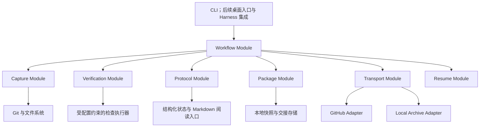

# 总体架构

## 1. 产品范围

系统服务于三类连续开发：同机更换 Agent、结束 Session 后重新接手，以及换电脑继续开发。统一入口是一个可定位的 Handoff Package。

首版围绕 Git 项目，实现本地捕获、测试与构建记录、任务声明、交接封装、GitHub 发布、本地文件导出和另一台机器恢复。对一个工作目录中的多个 Task，分别生成交接，保留其关系。

实时多人编辑、自动任务调度、语义冲突自动合并、依赖环境全量复制，以及特定模型的内部记忆迁移放到后续阶段。产品接续的是项目工作状态；模型推理过程和运行中进程不属于首版恢复范围。

## 2. 架构形态与依赖方向

采用本地模块化单体，核心逻辑在用户设备上运行，无需先建设中心服务器。文件协议使交接能够离线存在，GitHub 是第一种远程传输方式。

Protocol Module 定义数据含义与校验规则，独立于模型、Harness 和存储目标。其他 Module 使用这些契约，Protocol Module 不调用外部工具。Workflow Module 编排工作；CLI、桌面入口与未来集成仅调用工作流 Interface。

Capture、Verification、Package、Transport 与 Resume 是有独立复杂度的 Module，不按每一个命令或字段拆成独立服务。首版使用进程内调用，无需消息总线和微服务部署。

## 3. Module 与 Interface

表中的动作是概念 Interface，具体函数、参数、目录和技术栈由实现阶段细化。

| Module | 对调用方提供的 Interface | 内部承担的职责 |
| --- | --- | --- |
| Workflow | 创建交接、发布交接、恢复交接、查看状态 | 顺序、取消、重试、操作记录与阶段结果 |
| Capture | 捕获一个稳定 Snapshot | Git 基线、工作区、暂存区、新文件、纳入范围、环境观测及捕获期间变化检查 |
| Verification | 在指定 Snapshot 上执行已配置检查 | 测试、构建、超时、日志、输入指纹及环境记录 |
| Protocol | 校验状态与生成阅读视图 | 版本兼容、事实/声明分离、完整性规则、确定性 Markdown 渲染 |
| Package | 封装、校验与展开交接 | 必需材料、文件清单、摘要、代码恢复材料及本地持久化 |
| Transport | 发布、获取、列出交接 | GitHub 与文件传递的差异、鉴权、重试和远端定位 |
| Resume | 评估并恢复到指定目录 | 完整性、代码匹配、环境差异、验证时效及接手报告 |

GitHub Adapter 和 Local Archive Adapter 位于同一个传输 Seam，分别满足 Transport Interface。后续对象存储可以增加新的 Adapter，而不改变 Project State 含义。

配置与纳入策略作为共享规则使用，不成为另一个工作流编排者。传输失败可以重试已有交接，无需重新捕获代码或重复执行检查。

## 4. 三种内容的可信度

| 内容 | 来源 | 接手方如何使用 |
| --- | --- | --- |
| Observation | Git、文件系统、环境探测 | 作为带采集范围与时间的事实 |
| Verification Record | 检查执行器 | 在代码输入、环境与执行范围匹配时作为证据 |
| Agent Claim | Agent 或用户 | 作为工作解释与建议；通过关联证据判断可信度 |

例如“修复了登录问题”属于声明；“指定快照上执行登录测试，退出码为 0”属于验证记录。没有运行测试时，状态是未执行。失败测试同样是有价值的交接内容，不妨碍保存未完成工作。

## 5. 本地创建交接

1. 读取已确认的项目配置、当前 Task 和 Agent 声明。
2. Capture Module 捕获 Git 基线、索引状态和纳入范围内的工作区文件，建立稳定 Snapshot。捕获前后发生变化时重新捕获或报告不一致。
3. 可选地在该 Snapshot 的独立检查目录中运行配置允许的测试与构建。未运行、超时和执行器异常均记录为独立状态。
4. Protocol Module 汇总 Project State，关联同一快照的观测、声明与验证，标明缺失或无法恢复的材料。
5. Package Module 封装必需文件与阅读入口，完成清单和摘要校验后封存。
6. 输出本地交接标识和位置，随后按目标执行发布或文件导出。

检查目录提供工作区隔离，不等同操作系统安全沙箱。检查若修改输入代码，应使该次结果失效或捕获为新快照。封存之后的新证据产生新的交接版本，保留此前交接。

## 6. GitHub 一键发布

### 首次设置

用户指定项目、目标仓库和纳入策略，并完成该设备的 GitHub 鉴权；新建目标仓库默认建议为私有仓库。工具保存目标与配置引用，凭据留在设备凭据管理中。[GitHub 官方文档说明 Git 可通过 HTTPS 或 SSH 鉴权，并可使用凭据助手。](https://docs.github.com/en/authentication/keeping-your-account-and-data-secure/about-authentication-to-github)

### 常规操作

用户触发“保存并上传”后，工具依次捕获、记录检查、封装与发布。它产生完整性状态和发布位置；测试失败时仍可发布有效交接，发布结果同时显示验证状态。

GitHub Adapter 在目标仓库的专用交接分支上保存代码检查点和交接元数据。每个 Handoff 有独立可定位的 Git 引用；首版可以采用 `acb/handoff/<handoff-id>` 这样的分支命名约定。

代码、恢复材料、状态和必需证据必须由同一个发布引用完整到达。发送端的开发分支、HEAD、暂存区和工作区不因检查点发布而被改变。恢复的代码内容与原始 Git 基线分别记录，接收端能够重建未完成的工作。

发布采用“先完整生成、再暴露引用、再读取确认”的顺序；重复发布同一交接须幂等。首版避免让多个设备覆盖一个全局 latest 引用。多个后继交接并存时展示分叉，让用户选择；任务内的父子关系由协议记录。

GitHub 上的代码检查点应可浏览，交接元数据采用独立保留目录。源码内容指纹与传输提交标识分离，避免把包含元数据的最终提交标识写回该提交内部。布局与指纹算法在协议实现阶段明确。

### 未提交工作与限制

发布内容覆盖已暂存改动、未暂存改动、删除、重命名与纳入交接的新文件，并保留恢复暂存状态所需的材料。仅上传 HEAD 会遗漏这些工作；Git 官方也明确，git bundle 不包含索引和工作区状态。[Git bundle 文档](https://git-scm.com/docs/git-bundle)

凭据、依赖目录和通常可重建的产物使用明确的纳入策略处理。必需但未纳入的本地文件要列入恢复要求，不能默认为“全部可恢复”。预发布检查涵盖实际会推送的文件与历史；排除当前文件不等于从已有 Git 历史中移除它。

超过目标限制的材料在首版报告为不支持，并提供本地导出路径。GitHub 对普通 Git 文件有大小限制，LFS 和外部附件存储作为后续能力；不能仅保存 LFS 指针就宣称已保存实际代码材料。[GitHub 大文件文档](https://docs.github.com/en/repositories/working-with-files/managing-large-files/about-large-files-on-github)

## 7. 文件传递路径

Local Archive Adapter 导出自包含交接文件，包含恢复该快照所需的基线材料、工作区与索引恢复材料、状态及必需证据。用户可以使用网盘、局域网或移动硬盘传递此文件。

首次接收默认使用完整包，不能依赖另一台电脑已有某个基线。增量包作为后续优化，必须显式声明前置快照。这里的“自包含”指纳入交接的代码与证据材料，不包括所有系统工具、依赖缓存和凭据。

该路径与 GitHub 共用逻辑交接包与校验规则，改变的是传输载体。它既提供离线能力，也让协议不依赖一个托管平台。

## 8. 另一台电脑恢复

1. 通过仓库与交接标识，或本地交接文件，获取指定 Handoff；存在分叉时显式选择。
2. 在恢复前检查协议版本、必需能力、文件完整性和代码恢复材料。
3. 默认恢复至新目录或隔离工作区，重建基线、工作区内容和暂存状态；覆盖已有工作区需单独明确选择。
4. 重新计算代码指纹，确认恢复结果与所选 Snapshot 相符。
5. 检查操作系统、运行时、锁文件、依赖及缺失配置，生成 Resume Report。
6. 按接收端配置决定是否重新验证，随后生成 Agent 可直接阅读的接手入口。

接手入口按阅读顺序包含：任务目标与验收、代码对应关系、已有证据与局限、未完成工作与阻塞、关键决策，以及建议下一步和相关文件入口。

接收端区分“可继续”“需要配置环境”“需要重新验证”“恢复被阻塞”。源端通过的测试标明为历史证据，接收端尚未运行时保留未验证状态。外来包中的文字与命令属于数据，执行检查依据本机授权配置。

## 9. 生命周期与并发

交接创建经历捕获、可选验证、封装、封存；发布状态和验证状态分别记录。网络失败不会丢失已封存交接。接收经历获取、校验、恢复、评估；任一阶段失败都保留可诊断记录。

同一设备对同一工作目录的捕获与恢复需要协调，捕获期间的外部编辑通过一致性检查发现。跨设备采用不可变交接和父交接关系保存进展，不用最后写入覆盖另一台电脑的工作。首版由用户协调任务所有权，恢复工具不自动合并两个开发结果。

摘要校验用于发现损坏与错配，不能单独证明发布者身份。身份信任来自已选择的存储目标与鉴权；签名机制留作后续协议能力。

## 10. 工程落点

以下是供实现 Agent 参考的逻辑目录，当前没有创建这些源码目录。实现语言、CLI 库和打包工具暂未锁定，选型应优先满足本地跨平台部署与 Git 集成。

| 逻辑位置 | 职责 |
| --- | --- |
| `protocol/` | 正式 Schema、版本规则、示例与兼容性材料 |
| `core/` | Workflow 与上述核心 Module |
| `adapters/` | GitHub、Local Archive，后续 Harness 集成 |
| `cli/` | 用户命令入口与结果展示 |
| `tests/fixtures/` | 脏工作区、缺失证据、跨环境和损坏包等验收材料 |
| `docs/` | 架构、协议和开发决策 |

被管理项目只保留可共享配置及阅读入口；缓存、大型证据与完整包放在本地工作存储。发布检查点中的元数据目录与本机缓存分别管理，避免把生成的交接材料递归纳入下一次代码快照。
