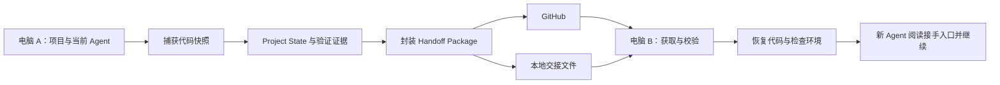

# Agent Context Bridge

面向多 AI Coding Agent 工作流的本地项目上下文交接工具。

> 建立模型无关、Agent 无关的项目状态协议，让另一个 Agent 在另一台电脑上，获得对应的代码、项目状态与验证证据，并继续未完成的任务。

本目录是架构交付，版本为 **v0.1，2026-09-30**。包含产品范围、模块职责、协议轮廓与开发接手顺序；具体源码、正式 Schema、命令参数与界面由后续开发任务实现。

## 两个核心能力

1. **上下文交接**：从 Git、测试、构建、环境信息和 Agent 声明生成 Project State，再封装为 Handoff Package。
2. **跨电脑续接**：将对应代码与交接包发布至 GitHub，或者导出为可传递的本地文件；另一台电脑获取、校验、恢复后，生成新 Agent 的接手入口。

“无缝”的产品目标是减少重复解释和手动搬运。验收以代码恢复正确、状态与证据对应、下一步明确为准；不同机器仍可能需要配置依赖或补齐凭据。

## 总体形态

采用 **本地模块化单体 + 版本化文件协议 + 可替换的传输 Adapter**。首版使用 CLI 完成整个交接闭环，之后桌面界面和 Harness 集成复用相同的核心 Interface。

## 文档入口

| 需要了解的内容 | 文档 |
| --- | --- |
| 总体结构、模块职责、同步与恢复流程 | [总体架构](docs/ARCHITECTURE.md) |
| Project State、Handoff Package 与证据规则 | [协议轮廓](docs/PROTOCOL-OUTLINE.md) |
| 后续 Agent 如何按阶段接手、如何验收 | [开发路线](docs/IMPLEMENTATION-ROADMAP.md) |
| 统一领域术语 | [术语表](CONTEXT.md) |
| Agent 的阅读入口与工作约束 | [Agent 接手说明](AGENTS.md) |
| 关键架构取舍 | [协议与集成分离](docs/adr/0001-protocol-first.md)、[交接快照独立于开发分支](docs/adr/0002-handoff-checkpoints.md) |

## 首版完成的标志

电脑 A 上的 Agent 留下一项未完成任务，项目同时存在已暂存、未暂存和新文件。工具生成交接包并发布至 GitHub；没有原目录的电脑 B 获取该交接，恢复纳入交接的代码，识别测试与环境的有效性，并向另一个 Agent 给出目标、阻塞与下一步。同一个交接也能通过离线文件完成恢复。

当前交付的是上述系统的架构，尚未实现或验证运行中的工具。
